# Medii de programare si dezvoltare
Acest repository conține proiectele dezvoltate pe parcursul celor 11 laboratoare, precum și proiectul final SchoolApp.  

## 📌 Structura Proiectului  
### Laboratoarele 1-6: WebApp dezvoltat cu ASP.NET Core și Entity Framework.  
### Laboratoarele 7-10: Aplicație multi-platformă cu .NET MAUI + SQLite.  
### Laboratorul 11: Extindere a aplicației MAUI cu WebAPI.  
### Proiectul Final: SchoolApp – un proiect complet, ce integrează funcționalități învățate pe parcursul laboratoarelor.  

📷 Capturi de Ecran  
Proiect	Capturi  

## WebApp (Lab 1-6)  	

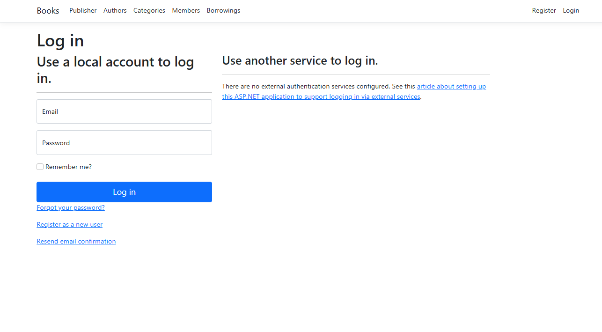
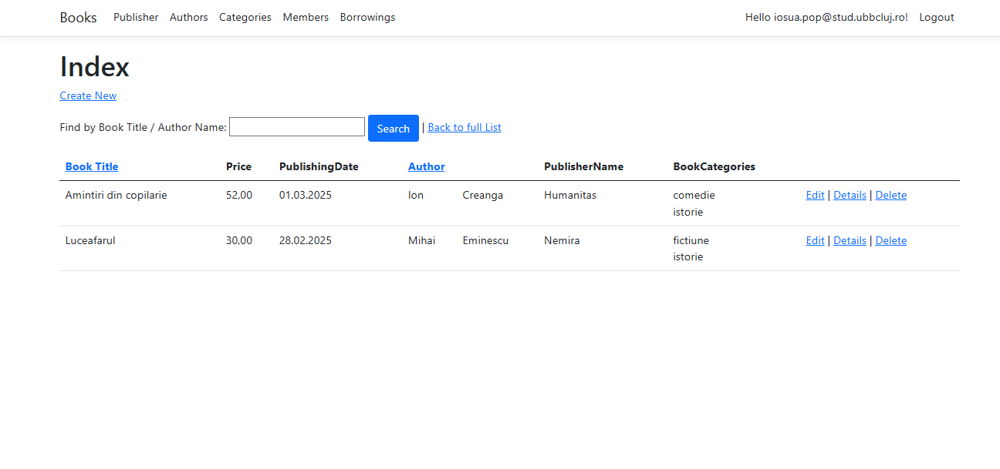
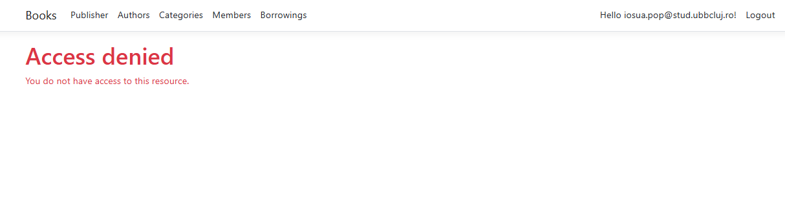

## Maui + SQLite (Lab 7-10)

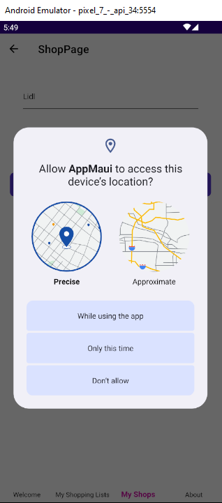
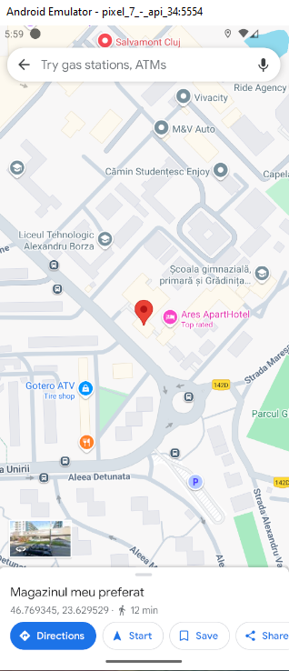
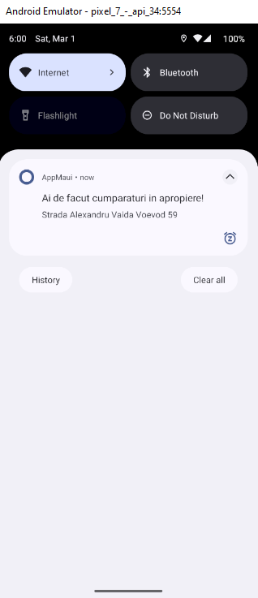
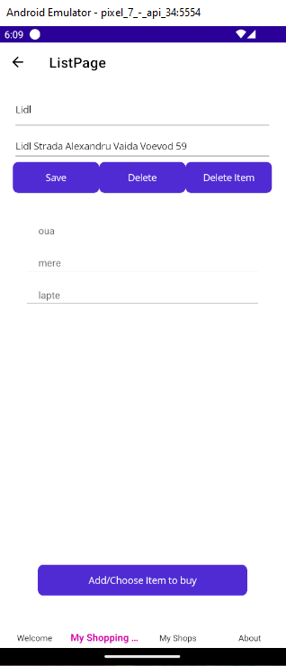

## SchoolApp (Proiect final)

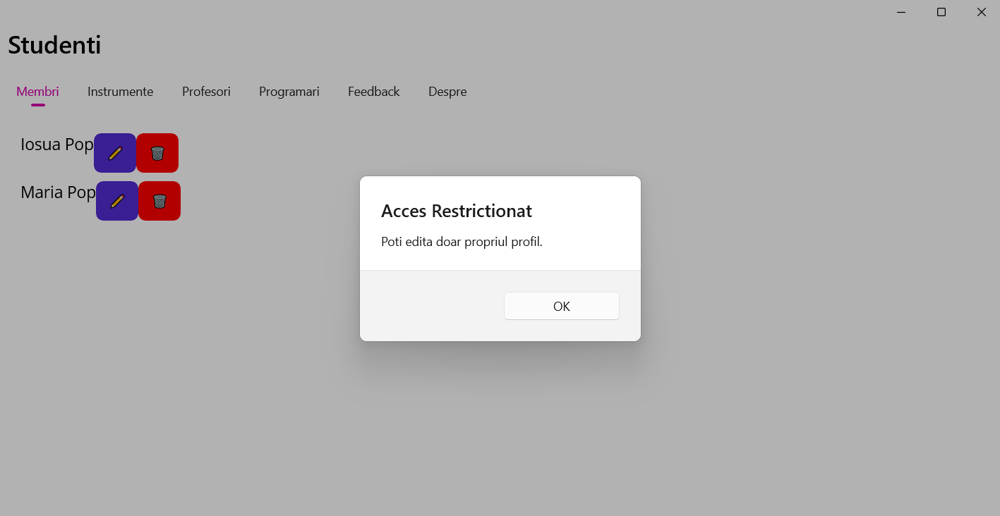
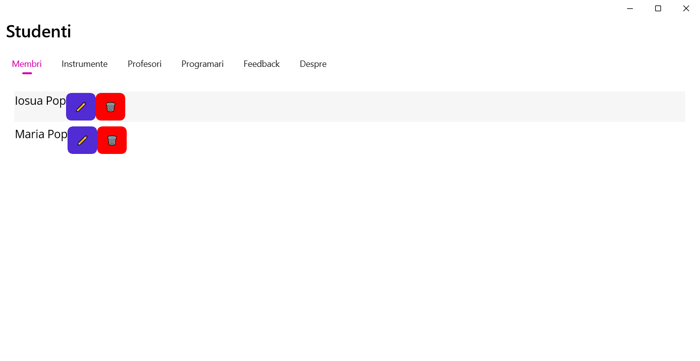
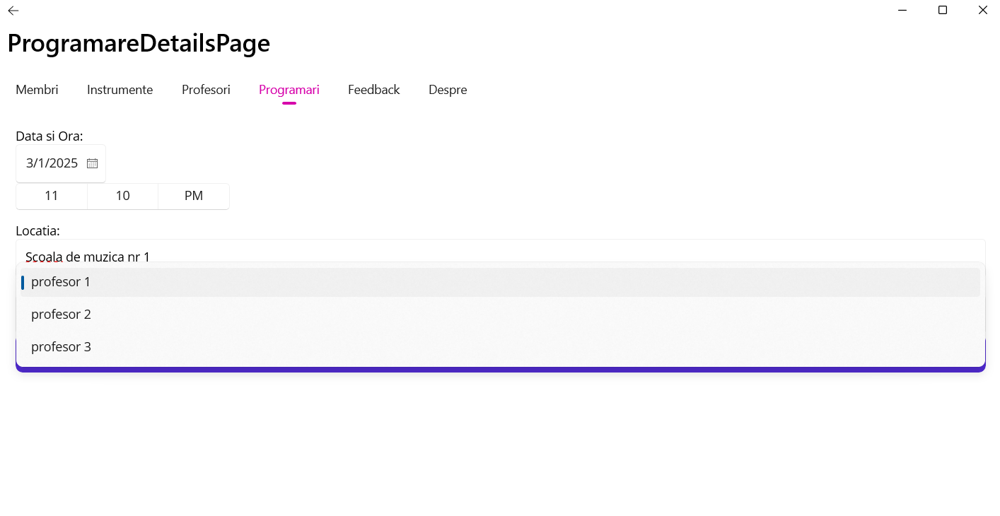
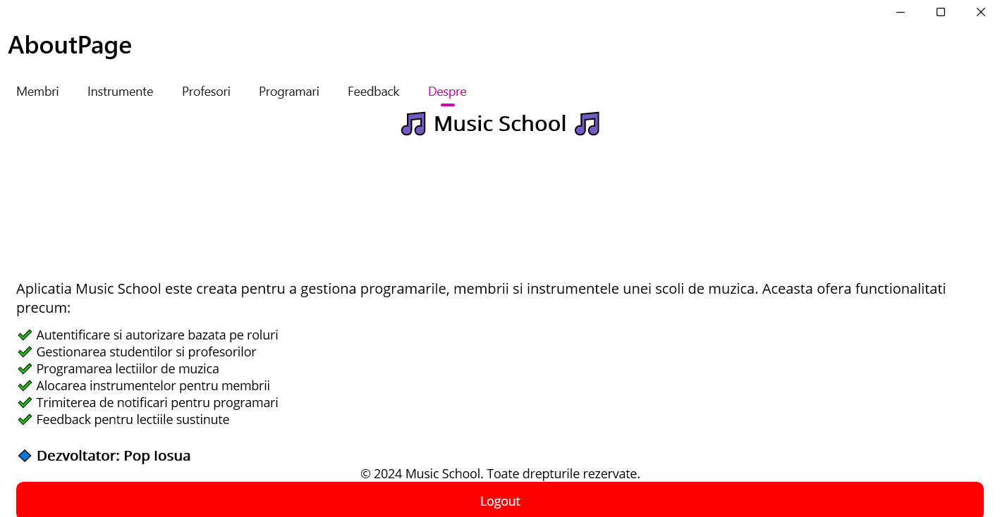
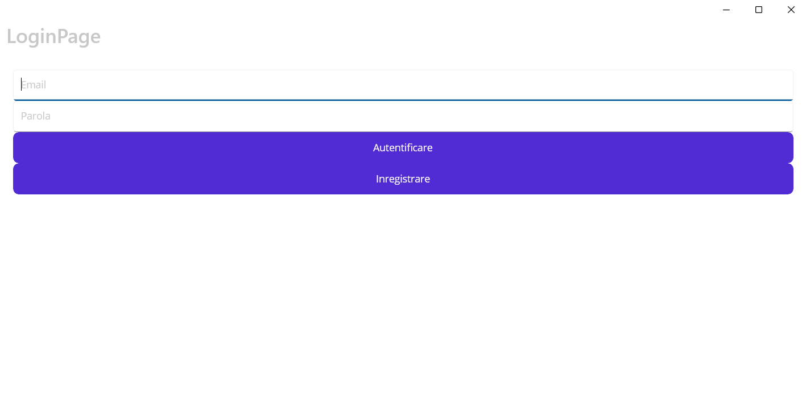

## 📖 Descrierea Laboratoarelor
### 🔹 Laborator 1 - Instalare și configurare  
### 🔹 Laborator 2 - Entity Framework Core (Code First)  
### 🔹 Laborator 3 - Relatii între entități  
### 🔹 Laborator 4 - Navigare între entități  
### 🔹 Laborator 5 - Autentificare  
### 🔹 Laborator 6 - Autorizare si Validare  

### 🔹 Laborator 7 - Aplicație multi-platformă cu .NET MAUI  
### 🔹 Laborator 8 - Lucrul cu SQLite  
### 🔹 Laborator 9 - Relații între entități în SQLite  
### 🔹 Laborator 10 - Funcționalități avansate (navigare + notificări)  

### 🔹 Laborator 11 - Extinderea cu WebAPI (servicii RESTful)  

## 🏆 Proiect Final - SchoolApp  
### SchoolApp este un sistem informatic complet destinat unei școli de muzică, construit utilizând .NET MAUI și SQLite. 
### Acest proiect înglobează toate cunoștințele acumulate în laboratoarele anterioare și oferă o soluție funcțională pentru gestionarea 
### programărilor studenților, notificări și administrare de date.

# 📌 Tehnologii utilizate

##       
